# MCP Protocol Map

Use this reference to orient on the whole protocol: which features exist, which layer they live in, what each builds on, and what is deliberately independent. Useful before deciding where a requirement belongs (primitive, utility, transport, extension) or explaining MCP structure to a user.

Verified on 2026-06-09 against:

- MCP specification `2025-11-25` (lifecycle, transports, authorization, utilities).
- MCP Apps specification `2026-01-26` (`modelcontextprotocol/ext-apps`).
- `modelcontextprotocol/ext-auth` draft extensions.

## The Map

Solid arrows mean "builds on / requires"; dashed arrows mean "applies across". Layer 1 is mandatory; everything above it is negotiated per connection and independently optional.

```mermaid
flowchart TD
    %% Solid arrow = "builds on / requires" · dashed = "applies across"

    subgraph BASE["1 · Base protocol — always present"]
        JSONRPC["JSON-RPC 2.0<br/>requests · responses · notifications · _meta"]
        LIFE["Lifecycle & capability negotiation<br/>initialize → capabilities → initialized<br/>protocol version (2025-11-25)"]
        STDIO["stdio transport<br/>local · logs to stderr"]
        SHTTP["Streamable HTTP transport<br/>Mcp-Session-Id · SSE streams · resumability · Origin validation"]
        AUTH["Authorization · OAuth 2.1<br/>RFC 9728 metadata · RFC 8707 resource · RFC 7591 DCR"]
    end

    LIFE --> JSONRPC
    STDIO --> JSONRPC
    SHTTP --> JSONRPC
    AUTH -- "HTTP only — stdio uses env/config" --> SHTTP

    subgraph SERVERF["2a · Server features — server advertises, client calls"]
        TOOLS["Tools<br/>tools/list · tools/call<br/>inputSchema / outputSchema · structuredContent · annotations"]
        RESOURCES["Resources<br/>resources/list · read · templates"]
        PROMPTS["Prompts<br/>prompts/list · get"]
        SUBS["Resource subscriptions<br/>subscribe → notifications/resources/updated"]
        COMPL["Completions<br/>argument autocomplete"]
        LOGGING["Logging<br/>notifications/message · logging/setLevel"]
    end

    subgraph CLIENTF["2b · Client features — client advertises, server calls back"]
        ROOTS["Roots<br/>roots/list"]
        SAMPLING["Sampling<br/>sampling/createMessage"]
        ELICIT["Elicitation<br/>form mode · URL mode"]
    end

    SERVERF -- "negotiated per capability" --> LIFE
    CLIENTF -- "negotiated per capability" --> LIFE
    SUBS --> RESOURCES
    COMPL --> PROMPTS
    COMPL --> RESOURCES

    subgraph UTIL["3 · Base utilities — overlay on any request, both directions"]
        PING["Ping"]
        PROGRESS["Progress<br/>progressToken in _meta"]
        CANCEL["Cancellation<br/>notifications/cancelled"]
        PAGINATION["Pagination<br/>opaque cursors on every list op"]
        LISTCHANGED["list_changed notifications<br/>tools · resources · prompts · roots"]
        TASKS["Tasks (experimental)<br/>durable async wrapper · poll · cancel · input_required"]
    end

    UTIL -.-> JSONRPC
    PAGINATION -.-> SERVERF
    LISTCHANGED -.-> SERVERF
    LISTCHANGED -.-> ROOTS
    TASKS -- "augments tools/call" --> TOOLS
    TASKS -- "augments sampling · elicitation" --> CLIENTF

    subgraph EXT["4 · Extensions — optional, negotiated via capabilities.extensions"]
        APPS["MCP Apps · io.modelcontextprotocol/ui<br/>ui:// HTML resources · text/html;profile=mcp-app<br/>_meta.ui on tools · postMessage bridge in sandboxed iframe"]
        EXTAUTH["ext-auth<br/>OAuth client credentials · enterprise-managed authorization"]
    end

    EXT -- "negotiated at initialize" --> LIFE
    APPS -- "ui:// served via resources/read" --> RESOURCES
    APPS -- "_meta.ui.resourceUri · app-only visibility" --> TOOLS
    EXTAUTH -- "extends core auth" --> AUTH

    classDef base fill:#eef2f7,stroke:#64748b,color:#0f172a
    classDef server fill:#e7f4ea,stroke:#2f855a,color:#1c4532
    classDef client fill:#fdf3e3,stroke:#b7791f,color:#5f370e
    classDef util fill:#f3e8fd,stroke:#805ad5,color:#322659
    classDef ext fill:#fde8ef,stroke:#b83280,color:#521b41
    class JSONRPC,LIFE,STDIO,SHTTP,AUTH base
    class TOOLS,RESOURCES,PROMPTS,SUBS,COMPL,LOGGING server
    class ROOTS,SAMPLING,ELICIT client
    class PING,PROGRESS,CANCEL,PAGINATION,LISTCHANGED,TASKS util
    class APPS,EXTAUTH ext
```

## What Is Deliberately Separate

- Server features (2a) and client features (2b) are fully independent of each other; they meet only at capability negotiation. A tools-only server and a sampling-capable client are both complete MCP participants. A bridge is one process on both sides of that line.
- Transports are interchangeable and feature-blind. Layers 2–4 never know which transport carries them. The one exception is authorization, which is defined only for HTTP transports.
- Utilities (layer 3) belong to no feature: ping, progress, cancellation, and `_meta` ride on any request in either direction; pagination and `list_changed` attach to every listable primitive; tasks wrap requests from both sides.
- Extensions are strictly additive. MCP Apps invents no primitives — it is conventions over resources (`ui://`), tools (`_meta.ui`), and JSON-RPC (re-spoken over postMessage). ext-auth extends the existing authorization layer. Core MCP works with no extensions at all.

## Where The Deep Guidance Lives

- Layer 1 transports, sessions, HTTP security: `mcp-runtime-utilities.md`. Authorization: `http-authorization.md`.
- Layer 2a primitives and when to use which: `mcp-server-primitives.md`. Schemas: `tool-schemas-and-output.md`.
- Layer 2b from the client side: `rmcp-client-patterns.md`. Both sides at once: `bridge-patterns.md`.
- Layer 3 utilities in tandem: `mcp-runtime-utilities.md`.
- Layer 4: sibling skill `mcp-apps-auth-rmcp-development` (`apps-architecture.md`, `apps-host-bridge.md`, `auth-extensions.md`).

## Caveat

This map reflects spec `2025-11-25`, which `rmcp` 1.7 targets. The `2026-07-28` revision moves the boundaries: `initialize` and `Mcp-Session-Id` leave the base protocol (stateless core), and Apps/Tasks become formal extensions — layers 1 and 3 shrink, layer 4 grows. See the Spec Trajectory note in `mcp-runtime-utilities.md`.
