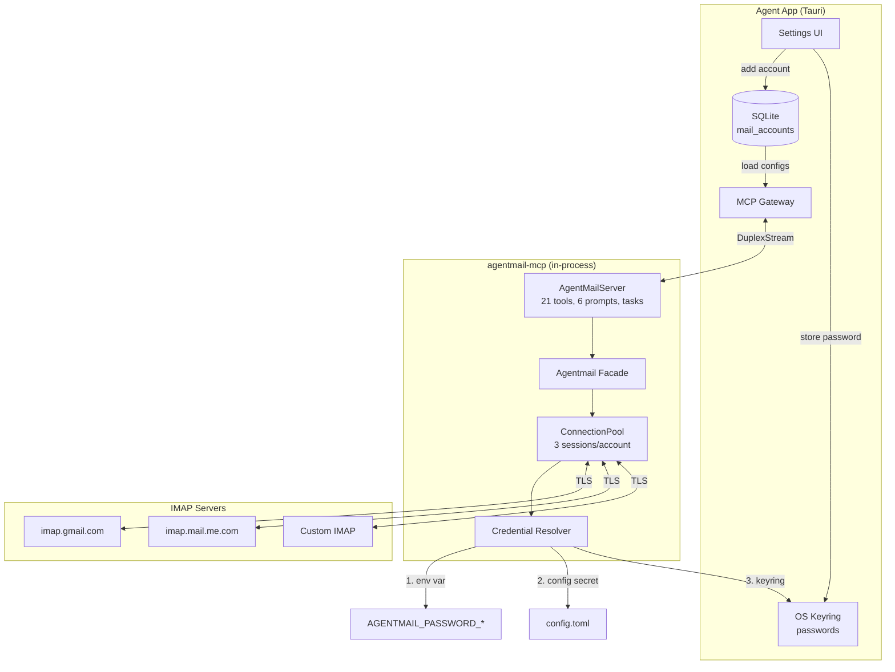
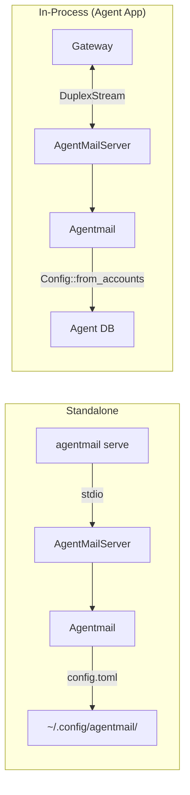
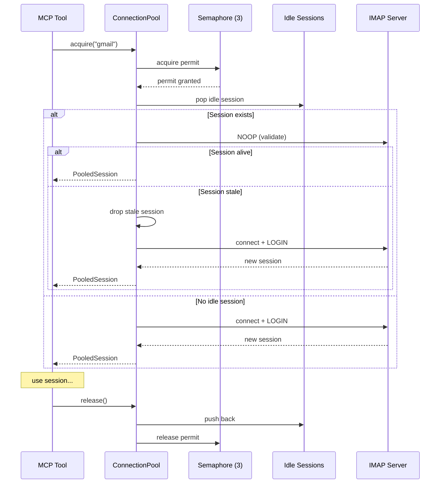
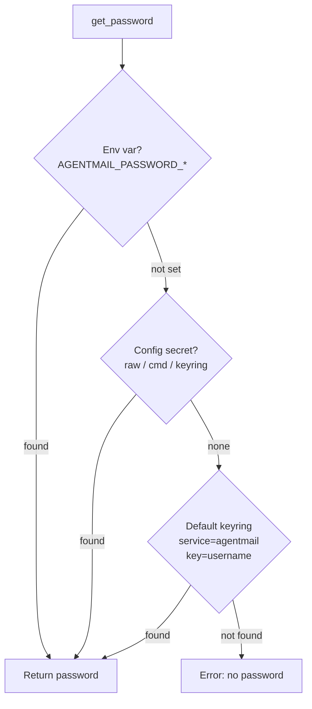

# Agentmail Design

## Overview

Agentmail is a cross-platform IMAP email client library with an MCP (Model Context Protocol) server for AI assistant integration. It provides 21 tools and 6 prompts for reading, searching, composing, organizing, and managing email across multiple accounts.

MCP protocol: [2025-06-18](https://modelcontextprotocol.io/specification/2025-06-18) (also negotiates 2025-03-26 and 2024-11-05) | rmcp 1.4

No Mail.app dependency. Pure IMAP over TLS. Works on macOS, Linux, and Windows.

## Architecture



## Two Operating Modes



|                 | Standalone                        | In-Process                                      |
| --------------- | --------------------------------- | ----------------------------------------------- |
| Binary          | `agentmail serve`                 | None (library)                                  |
| Transport       | stdio                             | DuplexStream                                    |
| Account config  | `~/.config/agentmail/config.toml` | Passed at spawn via `serve_on()`                |
| Password source | keyring (agentmail service)       | keyring (agent service)                         |
| Entry point     | `main.rs`                         | `agentmail_mcp::serve_on(transport, agentmail)` |

## Crate Structure

```
agentmail/
  src/
    lib.rs          # Agentmail facade (25+ async methods)
    main.rs         # CLI dispatch (clap), account configuration
    mcp.rs          # AgentMailServer, 21 tools, 6 prompts, task manager, serve_on()/serve_stdio()
    imap_client.rs  # Raw IMAP operations (SELECT, FETCH, SEARCH, STORE)
    connection.rs   # Per-account session pool + semaphore concurrency
    config.rs       # AccountConfig, Config (file + programmatic)
    credentials.rs  # Password resolution: env → config secret → default keyring
    secret.rs       # Secret resolution (raw / cmd / keyring)
    provider.rs     # MailProvider enum (Gmail, iCloud, Yahoo, Fastmail)
    parser.rs       # RFC822 parsing via mail-parser
    content.rs      # HTML → Markdown, truncation, cleanup
    draft.rs        # RFC822 composition via lettre
    types.rs        # MessageInfo, MailboxInfo, SearchCriteria, etc.
    error.rs        # AgentmailError enum
```

## Connection Pool



- Default 3 concurrent IMAP operations per account (configurable via `max_connections`), well within provider limits
- Sessions validated with NOOP before reuse
- Stale sessions dropped, fresh ones created on demand
- `PooledSession` auto-releases semaphore permit on drop

## Credential Resolution



When running in-process, the agent app calls `init_keyring_with_service("agent")` so passwords are stored under the agent's keyring service, not "agentmail". The signed agent app avoids macOS Keychain popups.

## MCP Tools (21)

### Read Operations (read_only_hint = true)

| Tool                  | Description                                                      |
| --------------------- | ---------------------------------------------------------------- |
| `list_accounts`       | List configured IMAP accounts                                    |
| `list_mailboxes`      | List mailboxes with counts, attributes (noSelect, noInferiors), and RFC 6154 roles |
| `list_capabilities`   | Query IMAP server capabilities                                   |
| `check_connection`    | Test IMAP connectivity                                           |
| `get_messages`        | Paginated fetch, newest-first by UID                             |
| `search_messages`     | IMAP SEARCH with text/header/flag filters                        |
| `list_flags`          | List all flags in use with counts; resolves Apple Mail colors    |
| `find_attachments`    | Scan for messages with attachments                               |
| `rank_senders`        | Rank senders by message count                                    |
| `rank_unsubscribe`    | Rank bulk-mail senders by List-Unsubscribe, sorted by one-click  |
| `rank_list_id`        | Rank mailing lists by List-Id (RFC 2919), groups across senders  |

### Write Operations

| Tool                   | Description                                                       |
| ---------------------- | ----------------------------------------------------------------- |
| `delete_messages`      | Delete by UID (up to 500)                                         |
| `delete_by_sender`     | Delete all from a sender, optionally across all mailboxes         |
| `delete_list_id`       | Delete all messages with a specific List-Id across all mailboxes  |
| `move_message`         | IMAP MOVE between mailboxes                                       |
| `create_mailbox`       | Create new folder                                                 |
| `create_draft`         | Compose RFC822 → Drafts folder                                    |
| `add_flags`            | Add flags and/or Apple Mail color (union semantics)               |
| `remove_flags`         | Remove flags and/or clear Apple Mail color                        |
| `unsubscribe_message`  | RFC 8058 one-click unsubscribe + bulk delete matching bulk mail   |
| `download_attachments` | Extract attachments to disk                                       |

## MCP Prompts (6)

| Prompt                | Description                                          |
| --------------------- | ---------------------------------------------------- |
| `inbox-summary`       | Comprehensive inbox overview                         |
| `cleanup-sender`      | Find & bulk-delete from a sender                     |
| `find-attachments`    | Scan for downloadable attachments                    |
| `compose-email`       | Guided draft composition                             |
| `unsubscribe-cleanup` | Identify & unsubscribe from mailing lists            |
| `list-id-cleanup`     | Identify mailing lists by List-Id and bulk-delete    |

## Provider Defaults

The `MailProvider` enum provides sensible IMAP defaults per provider. Users only need to enter their email and app password. Trash and drafts mailboxes are auto-detected at runtime via RFC 6154 special-use attributes (`\Trash`, `\Drafts`), with string-matching fallback for servers that don't support RFC 6154.

| Provider | Host                    |
| -------- | ----------------------- |
| Gmail    | `imap.gmail.com`        |
| iCloud   | `imap.mail.me.com`      |
| Yahoo    | `imap.mail.yahoo.com`   |
| Fastmail | `imap.fastmail.com`     |

## Content Processing

Email content flows through a pipeline:

1. **RFC822 parsing** (`mail-parser`) — extract headers, body parts, attachments
2. **Format selection** — prefer `text/plain`, fall back to `text/html`
3. **HTML conversion** (`fast_html2md`) — convert to Markdown
4. **Cleanup** — strip tracking pixels, collapse blank lines, decode entities
5. **Truncation** — cap at 100K chars for LLM context safety
6. **BODY.PEEK** — never marks messages as `\Seen` (read-only fetch)

## Key Design Decisions

- **Pure IMAP, no Mail.app** — cross-platform, works with any IMAP provider
- **Connection pooling** — 3 sessions/account avoids provider rate limits while enabling parallelism
- **BODY.PEEK throughout** — reading never has side effects
- **App passwords over OAuth** — simpler for users, no client ID registration needed
- **Config file for standalone, runtime injection for in-process** — same library code, different config sources
- **Passwords in OS keyring, never in DB** — proper security, no key management burden
- **Mailbox attributes** — RFC 6154 special-use roles (trash, junk, drafts, sent, archive, all, flagged) and RFC 3501 flags (noSelect, noInferiors) surfaced from IMAP LIST. Scan-all operations use roles to skip Trash/Junk/Drafts with string-matching fallback for servers without RFC 6154 support
- **Tool annotations** — `read_only_hint`, `destructive_hint`, `idempotent_hint` per MCP 2025-06-18 spec
- **Progress notifications** — long operations (rank_senders, find_attachments) report progress to MCP client
- **Task support (SEP-1686)** — 9 long-running tools support optional async task invocation (enqueue, poll, cancel). Destructive tasks targeting the same account are serialized to prevent IMAP state conflicts
