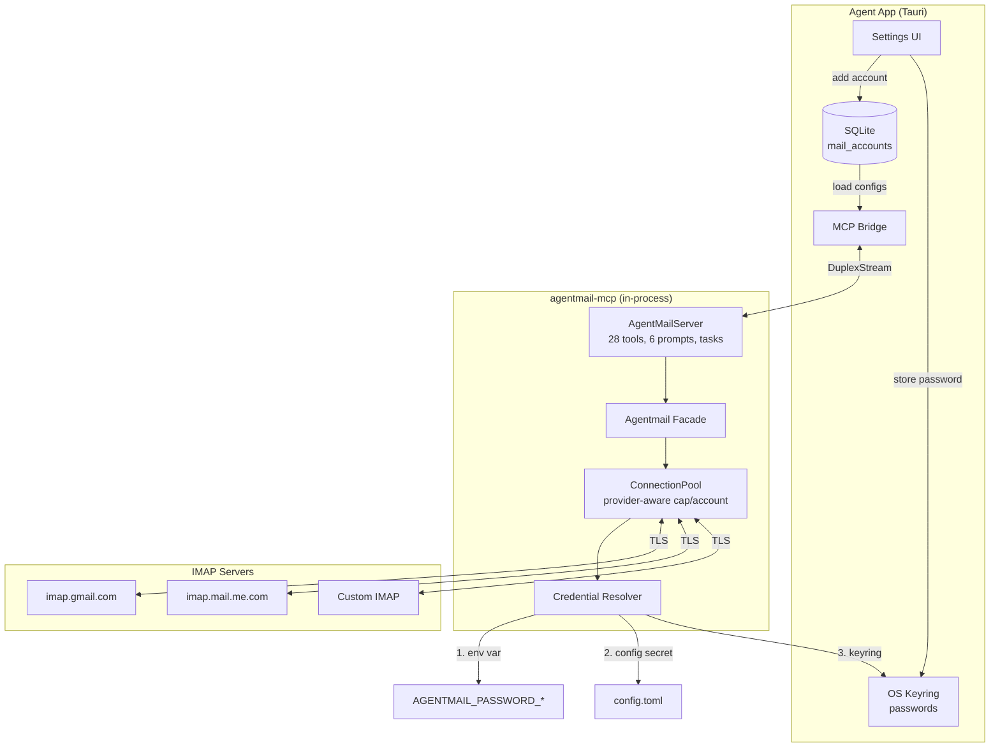
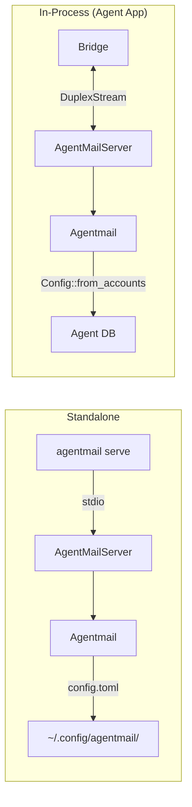
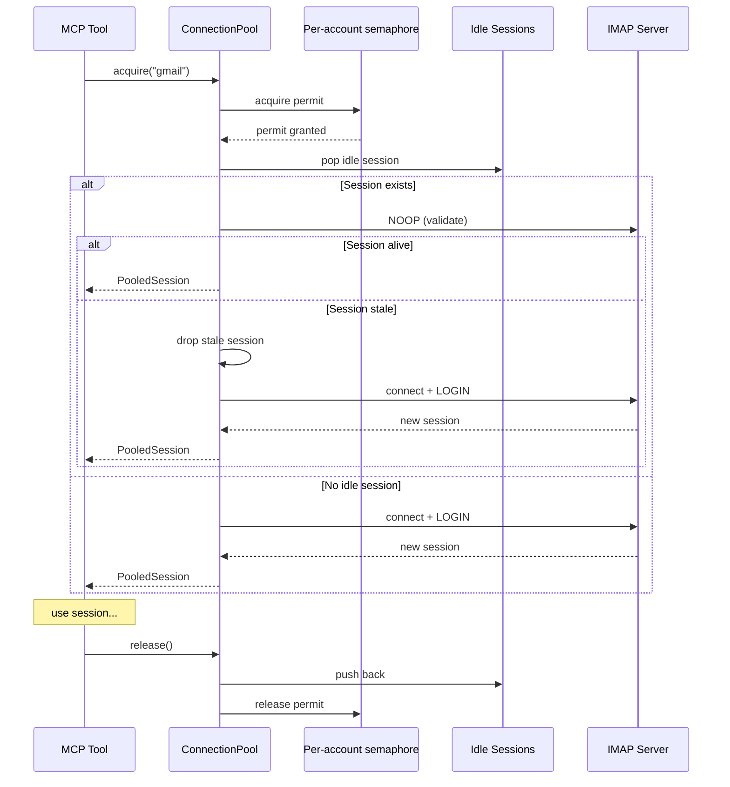
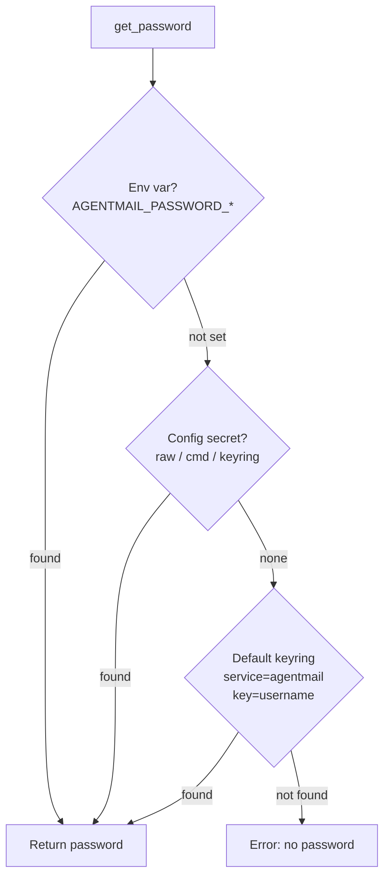

# Agentmail Design

## Overview

Agentmail is a cross-platform IMAP email client library with an MCP (Model Context Protocol) server for AI assistant integration. It provides 28 tools and 6 prompts for reading, searching, composing, organizing, and managing email across multiple accounts. [MCP.md](MCP.md) is the authoritative wire-contract catalog.

MCP protocol: [2025-11-25](https://modelcontextprotocol.io/specification/2025-11-25) (also negotiates 2025-06-18, 2025-03-26, and 2024-11-05) | rmcp 2.2

No Mail.app dependency. Pure IMAP over TLS. Works on macOS, Linux, and Windows.

## Architecture


```mermaid
graph TB
    subgraph "Agent App (Tauri)"
        UI[Settings UI]
        DB[(SQLite<br/>mail_accounts)]
        KR[OS Keyring<br/>passwords]
        GW[MCP Bridge]
    end

    subgraph "agentmail-mcp (in-process)"
        MCP[AgentMailServer<br/>28 tools, 6 prompts, tasks]
        MK[Agentmail Facade]
        POOL[ConnectionPool<br/>provider-aware cap/account]
        CRED[Credential Resolver]
    end

    subgraph "IMAP Servers"
        GMAIL[imap.gmail.com]
        ICLOUD[imap.mail.me.com]
        CUSTOM[Custom IMAP]
    end

    UI -->|add account| DB
    UI -->|store password| KR
    DB -->|load configs| GW
    GW <-->|DuplexStream| MCP
    MCP --> MK
    MK --> POOL
    POOL --> CRED
    CRED -->|1. env var| ENV[AGENTMAIL_PASSWORD_*]
    CRED -->|2. config secret| CFG[config.toml]
    CRED -->|3. keyring| KR
    POOL <-->|TLS| GMAIL
    POOL <-->|TLS| ICLOUD
    POOL <-->|TLS| CUSTOM
```

## Two Operating Modes


```mermaid
graph LR
    subgraph "Standalone"
        CLI[agentmail serve] -->|stdio| MCP1[AgentMailServer]
        MCP1 --> MK1[Agentmail]
        MK1 -->|config.toml| FS[~/.config/agentmail/]
    end

    subgraph "In-Process (Agent App)"
        GW2[Bridge] <-->|DuplexStream| MCP2[AgentMailServer]
        MCP2 --> MK2[Agentmail]
        MK2 -->|Config::from_accounts| DB2[Agent DB]
    end
```

|                 | Standalone                        | In-Process                                      |
| --------------- | --------------------------------- | ----------------------------------------------- |
| Binary          | `agentmail serve`                 | None (library)                                  |
| Transport       | stdio                             | DuplexStream                                    |
| Account config  | `~/.config/agentmail/config.toml` | Passed at spawn via `serve_on()`                |
| Password source | keyring (agentmail service)       | keyring (agent service)                         |
| Entry point     | `main.rs`                         | `agentmail_mcp::serve_on(transport, agentmail)` |

## Crate Structure

```
agentmail/
  src/
    lib.rs          # Agentmail facade (25+ async methods)
    main.rs         # CLI dispatch (clap), account configuration
    mcp/            # AgentMailServer, tools, prompts, tasks, resources, transports
    imap_client.rs  # Raw IMAP operations (SELECT, FETCH, SEARCH, STORE)
    connection.rs   # Per-account session pool + semaphore concurrency
    config.rs       # AccountConfig, Config (file + programmatic)
    credentials.rs  # Password resolution: env → config secret → default keyring
    secret.rs       # Secret resolution (raw / cmd / keyring)
    header_cache.rs # Live-validated UID/header ranking projection
    domain.rs       # Canonical sender-domain and public-suffix handling
    mutation_journal.rs # Retry-safe mutation reconciliation state
    mailbox_catalog.rs # Bounded mailbox-layout cache
    scan_plan.rs    # Discovery and mutation mailbox-selection policy
    provider.rs     # MailProvider enum (Gmail, iCloud, Yahoo, Fastmail)
    parser.rs       # RFC822 parsing via mail-parser
    content.rs      # HTML → Markdown, truncation, cleanup
    draft.rs        # RFC822 composition via lettre
    types.rs        # MessageInfo, MailboxInfo, SearchCriteria, etc.
    error.rs        # AgentmailError enum
```

## Connection Pool


```mermaid
sequenceDiagram
    participant Tool as MCP Tool
    participant Pool as ConnectionPool
    participant Sem as Per-account semaphore
    participant Sessions as Idle Sessions
    participant IMAP as IMAP Server

    Tool->>Pool: acquire("gmail")
    Pool->>Sem: acquire permit
    Sem-->>Pool: permit granted
    Pool->>Sessions: pop idle session
    alt Session exists
        Pool->>IMAP: NOOP (validate)
        alt Session alive
            Pool-->>Tool: PooledSession
        else Session stale
            Pool->>Pool: drop stale session
            Pool->>IMAP: connect + LOGIN
            IMAP-->>Pool: new session
            Pool-->>Tool: PooledSession
        end
    else No idle session
        Pool->>IMAP: connect + LOGIN
        IMAP-->>Pool: new session
        Pool-->>Tool: PooledSession
    end
    Note over Tool: use session...
    Tool->>Pool: release()
    Pool->>Sessions: push back
    Pool->>Sem: release permit
```

- Default 1 concurrent IMAP operation for Yahoo/AOL and 3 otherwise; configurable from 1 through 32
- Sessions validated with NOOP before reuse
- Stale sessions dropped, fresh ones created on demand
- `PooledSession` auto-releases semaphore permit on drop

## Credential Resolution


```mermaid
flowchart TD
    Start[get_password] --> Env{Env var?<br/>AGENTMAIL_PASSWORD_*}
    Env -->|found| Return[Return password]
    Env -->|not set| Config{Config secret?<br/>raw / cmd / keyring}
    Config -->|found| Return
    Config -->|none| Default{Default keyring<br/>service=agentmail<br/>key=username}
    Default -->|found| Return
    Default -->|not found| Error[Error: no password]
```

When running in-process, the agent app calls `init_keyring_with_service("agent")` so passwords are stored under the agent's keyring service, not "agentmail". The signed agent app avoids macOS Keychain popups.

Credential commands run with stdin closed, a 15-second deadline, and 64 KiB
bounds on each output stream. Non-zero exit, invalid UTF-8, empty output,
timeout, and overflow are distinct failures. Child processes are killed on
timeout/drop, and every `Secret` debug representation is redacted.

## MCP Tools

### Read Operations (read_only_hint = true)

| Tool                  | Description                                                      |
| --------------------- | ---------------------------------------------------------------- |
| `list_accounts`       | List configured IMAP accounts                                    |
| `list_mailboxes`      | List mailboxes with counts, attributes (noSelect, noInferiors), and RFC 6154 roles |
| `list_capabilities`   | Query IMAP server capabilities                                   |
| `check_connection`    | Test IMAP connectivity                                           |
| `get_messages`        | Paginated fetch, newest-first by UID                             |
| `search_messages`     | IMAP SEARCH with text/header/flag filters                        |
| `list_flags`          | List all flags in use with counts; resolves Apple Mail colors    |
| `find_attachments`    | Scan for messages with attachments                               |
| `top_senders`         | Rank senders by message count                                    |
| `top_domains`         | Rank exact sender domains/subdomains with a live sample subject  |
| `top_subscriptions`   | Rank bulk-mail senders by List-Unsubscribe, sorted by one-click  |
| `top_mailing_lists`   | Rank mailing lists by List-Id (RFC 2919), groups across senders  |
| `list_pending_moves`  | Inspect durable COPY-fallback operations needing recovery/review |

### Write Operations

| Tool                   | Description                                                       |
| ---------------------- | ----------------------------------------------------------------- |
| `delete_messages`      | Delete by UID (up to 500)                                         |
| `delete_by_sender`     | Delete all from a sender, optionally across all mailboxes         |
| `delete_by_domain`     | Delete all from one exact canonical sender domain                 |
| `delete_list_id`       | Delete all messages with a specific List-Id across all mailboxes  |
| `move_by_sender`       | Move messages from an exact sender identity                       |
| `move_by_domain`       | Move messages from one exact canonical sender domain              |
| `move_list_id`         | Move messages with an exact List-Id                               |
| `move_message`         | IMAP MOVE between mailboxes                                       |
| `reconcile_moves`      | Safely resume durable COPY-fallback operations                    |
| `create_mailbox`       | Create new folder                                                 |
| `create_draft`         | Compose RFC822 → Drafts folder                                    |
| `add_flags`            | Add flags and/or Apple Mail color (union semantics)               |
| `remove_flags`         | Remove flags and/or clear Apple Mail color                        |
| `unsubscribe_message`  | RFC 8058 one-click unsubscribe + bulk delete matching bulk mail   |
| `download_attachments` | Extract attachments to disk                                       |

## MCP Prompts (6)

| Prompt                | Description                                          |
| --------------------- | ---------------------------------------------------- |
| `inbox-summary`       | Comprehensive inbox overview                         |
| `cleanup-sender`      | Find & bulk-delete from a sender                     |
| `find-attachments`    | Scan for downloadable attachments                    |
| `compose-email`       | Guided draft composition                             |
| `unsubscribe-cleanup` | Identify & unsubscribe from mailing lists            |
| `list-id-cleanup`     | Identify mailing lists by List-Id and bulk-delete    |

## Provider Defaults

The `MailProvider` enum provides sensible IMAP endpoint defaults per provider.
Authentication can use an app password or an externally refreshed XOAUTH2
access token. Trash and drafts mailboxes are auto-detected at runtime via RFC
6154 special-use attributes (`\Trash`, `\Drafts`), with string-matching
fallback for servers that don't support RFC 6154.

| Provider | Host                    |
| -------- | ----------------------- |
| Gmail    | `imap.gmail.com`        |
| iCloud   | `imap.mail.me.com`      |
| Yahoo    | `imap.mail.yahoo.com`   |
| Fastmail | `imap.fastmail.com`     |

## Content Processing

Email content flows through a pipeline:

1. **RFC822 parsing** (`mail-parser`) — extract headers, body parts, attachments
2. **Format selection** — prefer `text/plain`, fall back to `text/html`
3. **HTML conversion** (`fast_html2md`) — convert to Markdown
4. **Cleanup** — strip tracking pixels, collapse blank lines, decode entities
5. **Truncation** — cap at 100K chars for LLM context safety
6. **BODY.PEEK** — never marks messages as `\Seen` (read-only fetch)

## Key Design Decisions

- **Pure IMAP, no Mail.app** — cross-platform, works with any IMAP provider
- **Connection pooling** — provider-aware per-account caps avoid login-rate-limit bursts while allowing parallelism where safe
- **BODY.PEEK throughout** — reading never has side effects
- **Password and XOAUTH2 authentication** — app passwords remain simple for standalone use; OAuth refresh/consent stays in an external token helper
- **Config file for standalone, runtime injection for in-process** — same library code, different config sources
- **Passwords in OS keyring, never in DB** — proper security, no key management burden
- **Mailbox attributes** — RFC 6154 special-use roles (trash, junk, drafts, sent, archive, all, flagged) and RFC 3501 flags (noSelect, noInferiors) surfaced from IMAP LIST. Scan-all operations use roles to skip Trash/Junk/Drafts with string-matching fallback for servers without RFC 6154 support
- **Tool annotations** — `read_only_hint`, `destructive_hint`, `idempotent_hint`, and optional task execution per MCP 2025-11-25
- **Progress notifications** — long operations report progress to the MCP client
- **Task support (SEP-1686)** — taskable operations support enqueue, poll, repeatable result retrieval, and cancellation. Destructive tasks targeting the same account are serialized to prevent IMAP state conflicts
- **Forward recovery for MOVE** — servers without native UID MOVE use a separate `synchronous=FULL` journal. Ambiguous COPY/cleanup outcomes return durable operation IDs and explicit pending/attention states; reconciliation never repeats COPY without evidence that the earlier attempt created nothing

## Configuration and Local Security

File-loaded configuration is normalized and validated before use. Hosts and
usernames must be non-empty, ports must be non-zero, `max_connections` must be
within `1..=32`, an explicit default account must exist, and plaintext IMAP
(`tls = false`) is refused. The interactive configurator validates the combined
TOML before replacing it atomically, uses `0600` files on Unix, and disables
terminal echo for password entry. A primary mailbox `email` is modelled
separately from the login username, and `aliases` are canonicalized and
deduplicated for own-address comparisons; opaque IMAP usernames remain valid.

## Verification

Pull requests exercise locked dependencies across Linux, macOS, and Windows.
Reusable workflows and third-party actions are pinned to immutable commits. A
weekly `cargo audit` job checks the lockfile, and a scheduled stress workflow
runs the ignored 216K-message header-cache snapshot test that is too expensive
for every pull request.
